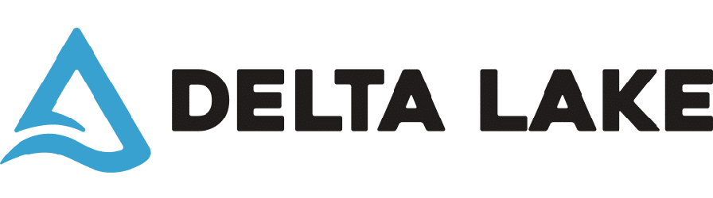
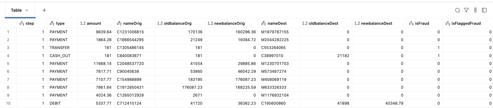
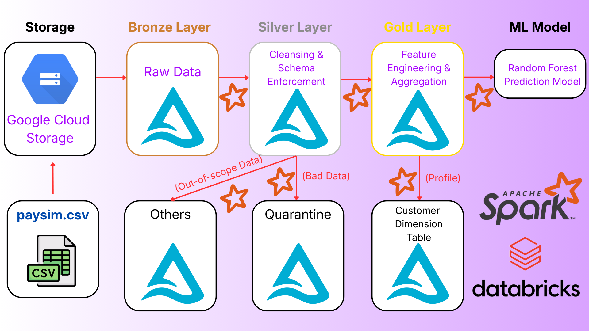
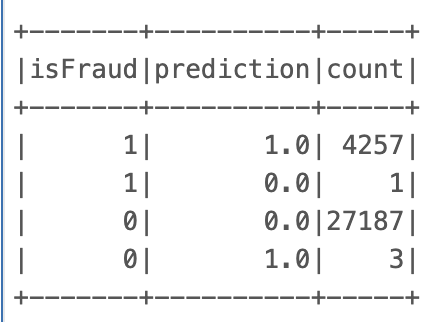
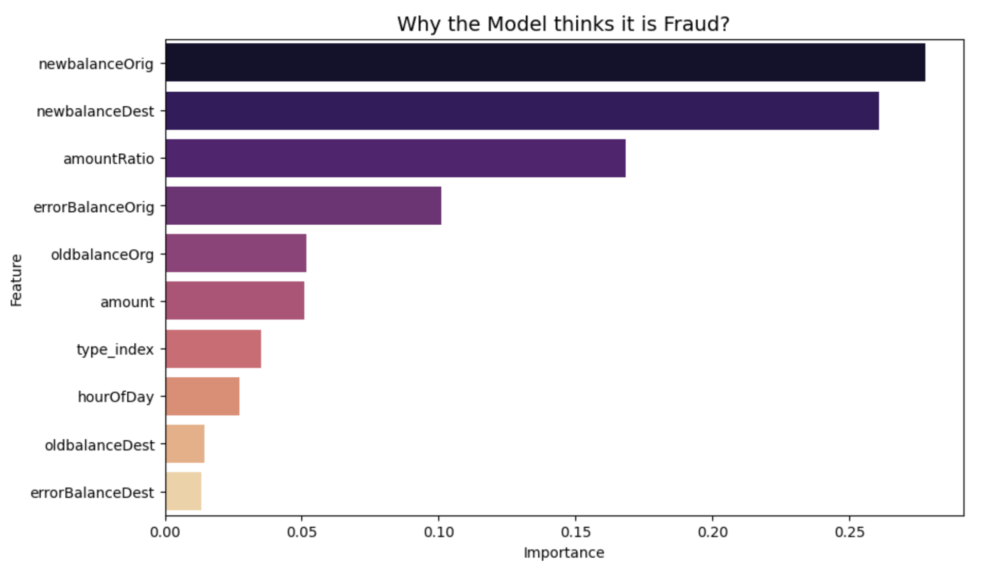

# 🛡️ End-to-End Fraud Detection Pipeline on Databricks

## 📌 Project Overview
Fraud is a massive problem in mobile money transactions. The challenge isn't just catching the thieves but it's catching them **without blocking genuine customers**.

In this project, I built a production-grade Data Engineering pipeline on **Databricks** to process over **6.3 million transactions**. By using the **Medallion Architecture** (Bronze/Silver/Gold) and **Delta Lake**, I ensured data integrity from ingestion to analysis. The final output is a Machine Learning model that detects fraud with **99.98% Recall** while maintaining **Near-Perfect Precision**.

*Snapshot of the processed transaction data.*

---

## 📂 Data Dictionary
Understanding the data is key to detecting patterns. Here are the features used in this project:

| Column Name | Description |
| :--- | :--- |
| **step** | Maps to a unit of time in the real world. In this simulation, **1 step is 1 hour**. |
| **type** | Transaction type (CASH-IN, CASH-OUT, DEBIT, PAYMENT, TRANSFER). *We focus only on TRANSFER and CASH_OUT.* |
| **amount** | Amount of the transaction in local currency. |
| **nameOrig** | Customer who started the transaction. |
| **oldbalanceOrg** | Initial balance before the transaction. |
| **newbalanceOrig** | New balance after the transaction. |
| **nameDest** | Customer who is the recipient of the transaction. |
| **oldbalanceDest** | Initial balance recipient before the transaction. |
| **newbalanceDest** | New balance recipient after the transaction. |
| **isFraud** | **Target Variable.** 1 = Fraud, 0 = Normal. |
| **isFlaggedFraud** | Legacy business rule (Transfers > 200,000). *Ignored in favor of our ML model.* |

---

## 🏗️ Architecture & Tech Stack
I designed the pipeline using the **Medallion Architecture** to guarantee data quality and lineage:

1.  **Ingestion (Bronze):** Securely ingests raw CSV data from Google Cloud Storage (GCS) into Delta Lake using **Spark Native Read**.
2.  **Transformation (Silver):** The data is cleaned and split into three paths:
    * **Silver:** Valid transactions for ML (Transfer/Cash-out).
    * **Others:** Out-of-scope data (Payment/Debit) archived for analytics.
    * **Quarantine:** Technical errors (e.g., negative amounts) isolated for auditing.
3.  **Feature Engineering (Gold):** Creation of behavioral features like `amountRatio` (Is the user emptying the account?) and `errorBalance` (Mathematical anomalies).
4.  **Machine Learning:** Training a Random Forest Classifier using **Strict Time-Series Splitting** to prevent data leakage.

**🛠️ Technologies:**
* **Platform:** Databricks (Spark Engine)
* **Storage:** Delta Lake (ACID Transactions)
* **Language:** Python (PySpark)
* **Security:** Key-based authentication (No hard-coded credentials in the notebook).

---

## 📉 Data Processing Statistics
The pipeline handled the entire dataset robustly. Here is the breakdown of the data flow:

| Layer / Status | Row Count | Description |
| :--- | :--- | :--- |
| **Raw Ingestion** | **6,362,620** | Full dataset ingested from GCS. |
| **Others (Archived)** | 3,592,211 | Payment & Debit transactions (Out of scope). |
| **Silver (ML Ready)** | 2,770,409 | Valid TRANSFER & CASH_OUT transactions. |
| **Quarantine** | **0** | *Data Quality Check Passed.* No records violated the "Non-Negative Amount" rule. |

**Sampling Strategy:**
To optimize for the Community Edition environment while handling class imbalance:
* **Training Set:** 114,547 rows (Included **100% of Fraud cases** + 5% of Normal cases).
* **Test Set:** 31,448 rows (Unseen future data, **sampled at 5%** to fit Community Edition memory limits).

---

## 🚀 Key Features Implementation

### 1. Secure & Scalable Engineering
I moved away from hard-coding credentials. The pipeline reads the GCP Service Account Key from a secure file, ensuring safety. Also, by using **Delta Lake**, I ensured that if the pipeline crashes mid-way, we don't end up with corrupted data (ACID guarantees).

### 2. Hunting the "Thief Behavior"
Fraudsters have specific patterns. I engineered features to expose them:
* **`amountRatio`**: Calculated as `Amount / OldBalance`. If this is close to 1.0, it means the user is emptying the account completely—a huge red flag.
* **`errorBalance`**: Checks if the math adds up. Often, fraudulent transactions bypass the standard balance updates in the backend.

### 3. Professional ML Strategy
Instead of a random split (which is wrong for time-series data), I used **Time-Series Splitting**.
* *Train:* Past data (Steps 0-600)
* *Test:* Future data (Steps 600+)
This simulates a real production environment where we can't see the future.

---

## 📊 Model Performance & Results
I evaluated the model on the unseen test set of **31,448 transactions**. The results were outstanding:

### 🎯 Key Metrics
| Metric | Score | Interpretation |
| :--- | :--- | :--- |
| **Precision** | **99.93%** | **Extremely Trustworthy.** If the model says "Fraud", it's almost certainly fraud (Only 3 False Positives). |
| **Recall** | **99.98%** | **No Escape.** The model caught 4,257 out of 4,258 fraudsters. |
| **F1-Score** | **0.9995** | The perfect balance. |

### 🔍 Confusion Matrix
The numbers speak for themselves. Out of thousands of transactions, we missed only **1 fraud case**.

| | Predicted: Normal | Predicted: Fraud |
| :--- | :---: | :---: |
| **Actual: Normal** | 27,187 (TN) | **3 (FP)** |
| **Actual: Fraud** | **1 (FN)** | **4,257 (TP)** |

### 📈 Feature Importance
What gave the thieves away? The model relied heavily on **`newbalanceOrig`** and **`newbalanceOrig`** and **`amountRatio`**, confirming that the "Emptying Account" behavior is the strongest predictor of fraud.

--

## 💡 Conclusion
This project demonstrates that high accuracy isn't enough. You also need **Precision and Recall** in the right balance. By combining **Data Engineering best practices** (Delta Lake, Secure Ingestion) with **Scientific Rigor** (Time-Series Splitting), I built a pipeline that is not just a concept, but a **Production-Ready** solution.
