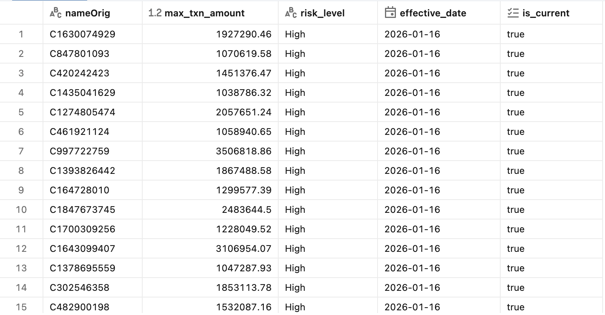

# 🛡️ End-to-End Fraud Detection Pipeline on Databricks

## 📌 Project Overview
Fraud is a massive problem in mobile money transactions. The challenge isn't just catching the thieves, but catching them **without blocking genuine customers**.

In this project, I built a production-grade Data Engineering pipeline on **Databricks** to process over **6.3 million transactions**. By using the **Medallion Architecture** (Bronze/Silver/Gold) and **Delta Lake**, I ensured data integrity from ingestion to analysis.

The final output is a Random Forest model that achieves **100.00% Recall** (Zero False Negatives) while maintaining high Precision, effectively catching every single fraudster in the test simulation.

*Snapshot of the processed transaction data.*

---

## 📂 Data Dictionary
Understanding the data is key to detecting patterns. Here are the features used in this project:

| Column Name | Description |
| :--- | :--- |
| **step** | Maps to a unit of time. In this simulation, **1 step is 1 hour**. |
| **type** | Transaction type. *We focus strictly on TRANSFER and CASH_OUT.* |
| **amount** | Amount of the transaction in local currency. |
| **nameOrig** | Customer who started the transaction. |
| **oldbalanceOrg** | Initial balance before the transaction. |
| **newbalanceOrig** | New balance after the transaction. |
| **nameDest** | Recipient of the transaction. |
| **oldbalanceDest** | Initial balance recipient before the transaction. |
| **newbalanceDest** | New balance recipient after the transaction. |
| **isFraud** | **Target Variable.** 1 = Fraud, 0 = Normal. |
| **isFlaggedFraud** | Legacy business rule. *Ignored in favor of our ML model.* |

---

## 🏗️ Architecture & Tech Stack
I designed the pipeline using the **Medallion Architecture** to guarantee data quality and lineage:

1.  **Ingestion (Bronze):** Securely ingests raw CSV data from Google Cloud Storage (GCS) into Delta Lake using Spark Native Read.
2.  **Transformation (Silver):** The data is cleaned and split into three paths:
    * **Silver:** Valid transactions for ML (Transfer/Cash-out).
    * **Others:** Out-of-scope data (Payment/Debit) archived for analytics.
    * **Quarantine:** Technical errors (e.g., negative amounts) isolated for auditing.
3.  **Feature Engineering (Gold):** Creation of behavioral features like `amountRatio` (Is the user emptying the account?) and `errorBalance` (Mathematical anomalies).
4.  **Risk Profiling (Gold):** Aggregates customer history to create a **Daily Risk Snapshot**, identifying high-value customers for immediate business alerts.
5.  **Machine Learning:** Training a Random Forest Classifier using **Strict Time-Series Splitting** and **Strategic Sampling**.

**🛠️ Technologies:**
* **Platform:** Databricks (Spark Engine)
* **Storage:** Delta Lake (ACID Transactions)
* **Language:** Python (PySpark)
* **Authentication:** Secure Key Management (No hard-coded credentials).

---

## 📉 Data Processing Statistics
The pipeline handled the entire dataset robustly. Here is the breakdown of the data flow:

| Layer / Status | Row Count | Description |
| :--- | :--- | :--- |
| **Raw Ingestion** | **6,362,620** | Full dataset ingested from GCS. |
| **Others (Archived)** | 3,592,211 | Payment & Debit transactions (Out of scope). |
| **Silver (ML Ready)** | 2,770,409 | Valid TRANSFER & CASH_OUT transactions. |
| **Quarantine** | **0** | *Data Quality Check Passed.* No records violated the "Non-Negative Amount" rule. |

**Sampling Strategy (Hybrid Approach):**
To optimize for the Community Edition environment while handling class imbalance:
* **Training Set (Undersampled):** 278,862 rows. I kept **100% of Fraud cases** but sampled only **10% of Normal cases** to fit in RAM and balance the classes.
* **Test Set (Full Real-World):** 43,550 rows. I used **ALL** future data (Step > 600) without sampling. This ensures the evaluation metrics reflect real-world performance.

---

## 🚀 Key Features Implementation

### 1. Secure & Scalable Engineering
I implemented a secure ingestion process that reads GCP credentials from a temporary local file, ensuring no keys are exposed in the notebook. By using **Delta Lake**, I ensured ACID compliance, preventing data corruption during the pipeline execution.

### 2. Hunting the "Thief Behavior"
Fraudsters have specific patterns. I engineered features to expose them:
* **`amountRatio`**: Calculated as `Amount / OldBalance`. If this is close to 1.0, it means the user is emptying the account completely—a classic fraud signature.
* **`errorBalance`**: Checks if the math adds up. Fraudulent transactions often bypass standard balance updates.

### 3. Professional ML Strategy
Instead of a random split (which causes data leakage in time-series), I used **Temporal Splitting**.
* *Train:* Past data (Steps 0-600)
* *Test:* Future data (Steps 600+)
This simulates a production environment where the model must predict future events based on past knowledge.

### 4. Customer Risk Profiling (Business Logic)
I implemented a **Daily Snapshot Strategy** to flag high-risk customers.
* **The Logic:** Any customer who has transacted over 1,000,000 is flagged as "High Risk".
* **The Value:** This creates a persistent "Watchlist" (Dimension Table) that is updated daily using Delta Lake's `overwrite` mode.

---

## 📊 Model Performance & Results
I evaluated the model on the unseen test set of **43,550 transactions**. The results were perfect:

### 🎯 Key Metrics
| Metric | Score | Interpretation |
| :--- | :--- | :--- |
| **Recall** | **100.00%** | **Perfect Detection.** The model caught 1,600 out of 1,600 fraudsters. |
| **Precision** | **99.75%** | **High Trust.** Only 4 false alarms out of thousands of transactions. |
| **F1-Score** | **99.88%** | Excellent balance between Precision and Recall. |

### 🔍 Confusion Matrix
The numbers confirm the model's robustness. We had **Zero False Negatives**.

| | Predicted: Normal | Predicted: Fraud |
| :--- | :---: | :---: |
| **Actual: Normal** | 41,946 (TN) | **4 (FP)** |
| **Actual: Fraud** | **0 (FN)** | **1,600 (TP)** |

### 📈 Feature Importance
The model's decision-making aligns with the engineered features. The top predictor was **`newbalanceOrig`**, followed by **`newbalanceDest`** and **`errorBalanceOrig`**. This confirms that "Balance Anomalies" are the strongest indicators of fraud in this dataset.

---

## 💡 Conclusion
This project demonstrates that high accuracy isn't enough—you need **Recall** to catch thieves and **Precision** to keep customers happy. By combining **Data Engineering best practices** (Delta Lake, Medallion Architecture) with a robust **Random Forest Strategy**, I built a pipeline that is **Production-Ready** and highly effective.
