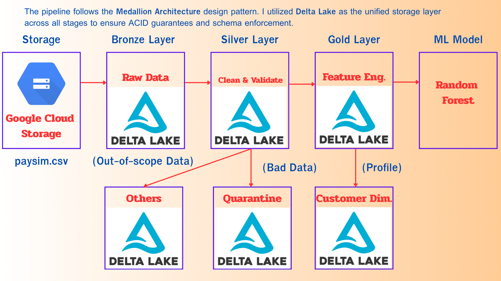

# 🛡️ End-to-End Fraud Detection Pipeline on Databricks

<div align="center">


</div>

## 📌 Project Overview
This project demonstrates a scalable Data Engineering pipeline built to detect fraudulent mobile money transactions. Using **Databricks** and the **Medallion Architecture**, the system processes over **6.3 million transactions**, enforces data quality, and utilizes Machine Learning to identify fraud patterns with high precision.

**Business Goal:**
The primary objective was to maximize fraud detection (Recall) while maintaining **Near-Perfect Precision (>99%)** to ensure that genuine customer transactions are almost never blocked (minimizing customer friction).


*Snapshot of the processed transaction data.*

---

## 🏗️ Architecture & Tech Stack

The pipeline follows the **Medallion Architecture** design pattern (Bronze $\to$ Silver $\to$ Gold) to ensure data lineage and quality:



1.  **Ingestion (Bronze):** Ingest raw CSV data (~6.3M rows) into Delta Lake.
2.  **Transformation (Silver)**: Implements a 3-way data split:
Silver: Valid data for ML (Transfer/Cash-out).
Others: Out-of-scope data (Payment/Debit) archived for analytics.
Quarantine: Technical errors (e.g., negative amounts) for auditing.
3.  **Feature Engineering (Gold):** Create behavioral features such as `amountRatio` (emptying accounts) and `errorBalance`.
4.  **Machine Learning:** Train a Random Forest Classifier using Spark MLlib.

**🛠️ Technologies:**
* **Cloud Source:** Google Cloud Storage (GCS)
* **Platform:** Databricks (Spark Engine)
* **Storage:** Delta Lake
* **Language:** Python (PySpark)
* **ML Library:** Spark MLlib

### 💾 Storage Layer: Why Delta Lake?
All data layers (Bronze, Silver, Gold, Quarantine, and Others) are stored using the **Delta Lake format**. This architecture was selected to ensure:

1.  **Reliability (ACID Transactions):** Guarantees that data writes are either fully completed or not done at all, preventing partial data corruption during the pipeline runs.
2.  **Quality Control:** Utilizes **Schema Enforcement** to automatically reject data that doesn't match the predefined structure.
3.  **Performance:** Optimized for handling large-scale datasets (6.3M+ rows) with scalable metadata handling.

---

## 🚀 Key Features Implementation

To effectively catch fraudsters, I implemented a robust pipeline that handles data quality, customer profiling, and advanced feature engineering:

### 1. Intelligent Data Routing (Silver Layer)
Instead of simply deleting data, I implemented a strategic 3-way split to handle data lifecycles:
* **Silver Table (Target):** Filters only TRANSFER and CASH_OUT transactions, which are the relevant scopes for fraud detection.
* **Others Table (Out-of-Scope):** Automatically archives valid but irrelevant transaction types (e.g., PAYMENT, DEBIT) for future analytics rather than discarding them.
* **Quarantine Table (Bad Data):** Segregates technical errors (e.g., negative amounts) into a separate table for auditing, ensuring the ML pipeline remains clean.

### 2. Customer Risk Profiling (Gold Layer)
Beyond individual transactions, I created a **Customer Dimension Table** (`dim_customer_risk`) to track user risk history.
* **Logic:** Aggregates historical transaction data to identify high-value customers.
* **Risk Tagging:** Flagged customers with single transactions exceeding 1M as "High Risk".

### 3. Machine Learning Features (Gold Layer)
I utilized a total of **10 input features**, combining raw transaction data with advanced engineered features:

**A. Engineered Features (Derived via Spark)**
* **`amountRatio`**: *(Amount / OldBalance)* - Detects "account emptying" behavior, where fraudsters drain the exact remaining balance.
* **`errorBalanceOrig`**: *(NewBal - (OldBal - Amount))* - Identifies mathematical anomalies in the origin account (e.g., balance didn't decrease as expected).
* **`errorBalanceDest`**: *(NewBal - (OldBal + Amount))* - Identifies anomalies in the destination account.
* **`hourOfDay`**: *(step % 24)* - Extracts the time of day to detect transactions occurring during unusual hours.
* **`type_index`**: Encoded transaction type (Focusing on `TRANSFER` vs `CASH_OUT`).

**B. Core Transaction Features (Raw)**
* **`amount`**: Transaction value (Consistently a top predictor).
* **`oldbalanceOrg` / `newbalanceOrig`**: Balances of the sender.
* **`oldbalanceDest` / `newbalanceDest`**: Balances of the recipient.

---

## 📊 Model Performance & Results

The pipeline processed the full dataset (**6.3M+ records**). However, the Random Forest model was trained specifically on the **2,770,409 relevant records** (`TRANSFER` & `CASH_OUT` types) where fraud actually occurs.

*(Note: The provided notebook code includes a 10% sampling step to allow for faster execution in limited demo environments, but the results below are based on the full 2.77M dataset.)*

### 🎯 Key Metrics (Fraud Class Focus)

| Metric | Score | Interpretation |
| :--- | :--- | :--- |
| **Precision** | **99.33%** | **Extremely High Accuracy.** Out of 150 flagged transactions, 149 were actual fraud. Only 1 false alarm. |
| **Recall** | **80.98%** | **Strong Detection Rate.** Successfully caught 149 out of 184 total fraudsters. |
| **F1-Score** | **89.22%** | A balanced performance between Precision and Recall. |

### 🔍 Deep Dive: Confusion Matrix
The confusion matrix below confirms the model's reliability:

* **Total Fraud Cases:** 184
* **Caught:** 149
* **Missed:** 35
* **False Positives:** Only **1** (Out of ~55,000 normal transactions tested)


### 📈 Feature Importance
What drives the fraud detection? The graph below shows that **`newbalanceOrig`**, **`amount`**, and **`amountRatio`** are the most critical indicators used by the model.


---

## 📂 Project Structure

```text
├── notebooks/          # Source code (Databricks/Jupyter notebooks)
├── images/             # Project screenshots and visualizations
│   ├── data_sample.png
│   ├── confusion_matrix.png
│   └── feature_importance.png
├── requirements.txt    # Project dependencies
└── README.md           # Project documentation
```

## 💡 Conclusion & Future Work

This project successfully demonstrates how to build a scalable, end-to-end data pipeline using **Spark** and **Delta Lake** on Databricks. By implementing the **Medallion Architecture**, the system ensures data quality from ingestion to analytics.

The final Random Forest model achieved the primary business objective: **minimizing customer friction** (Precision **99.33%**) while maintaining a strong detection rate (Recall **80.98%**). This proves that the engineered features (`amountRatio`, `errorBalance`, `hourOfDay`) were effective in distinguishing fraudsters from genuine users.

**Future Improvements (Path to Production):**
1.  **Real-time Streaming:** Convert the ingestion layer to **Spark Structured Streaming** to block fraud transaction-by-transaction in real-time.
2.  **Advanced Tuning:** Implement **Hyperparameter Tuning (GridSearch)** or adjust **Class Weights** to further improve Recall without sacrificing Precision.
3.  **Orchestration:** Deploy using **Databricks Workflows** for automated daily runs and integrate with **MLflow** for model versioning.

---
